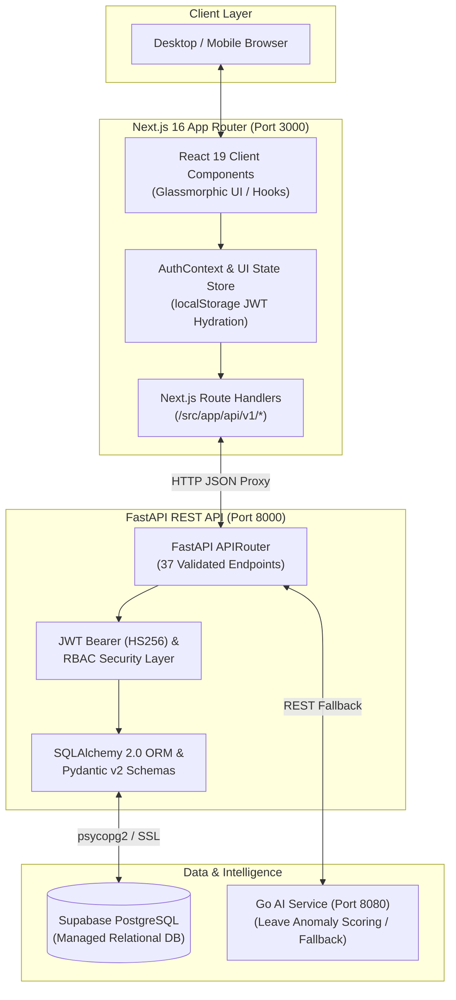

# DAYFLOW — Human Resource Management System (HRMS)

<p align="center">
  <strong>An enterprise-grade, full-stack Human Resource Management System built with Next.js 16, FastAPI, Supabase PostgreSQL, and Go AI Services.</strong>
</p>

<p align="center">
  
  
  
  
  
  
</p>

---

## 📋 Table of Contents

- [Overview](#-overview)
- [System Architecture](#-system-architecture)
- [Core Features & Modules](#-core-features--modules)
- [Tech Stack](#-tech-stack)
- [Repository Structure](#-repository-structure)
- [API Architecture & Contract](#-api-architecture--contract)
- [Security & RBAC Matrix](#-security--rbac-matrix)
- [Getting Started & Local Setup](#-getting-started--local-setup)
  - [Prerequisites](#prerequisites)
  - [1. Backend Setup](#1-backend-setup)
  - [2. Frontend Setup](#2-frontend-setup)
  - [3. AI Service Setup (Optional)](#3-ai-service-setup-optional)
- [Demo Credentials](#-demo-credentials)
- [Testing & Quality Assurance](#-testing--quality-assurance)
- [Documentation Directory](#-documentation-directory)
- [License](#-license)

---

## 🌟 Overview

**Dayflow** is a modular, high-performance Human Resource Management System designed for modern enterprises. It provides automated attendance lifecycles, multi-stage leave management with AI anomaly detection, transparent payroll processing, comprehensive employee directories, and dedicated role-based dashboards for employees and HR administrators.

The application couples a reactive **Next.js 16 (React 19)** frontend with a clean **FastAPI (Python 3.11)** REST API layer backed by **Supabase PostgreSQL** via **SQLAlchemy 2.0** and **Alembic**, with analytical intelligence powered by a standalone **Go microservice**.

---

## 🏛 System Architecture

The project employs a secure server-side proxy topology: the browser communicates exclusively with local Next.js Route Handlers (`/api/v1/*`), which forward validated requests with JWT credentials to the FastAPI backend on port `8000`.



---

## 🚀 Core Features & Modules

### 1. 🔐 Authentication & Session
- **OAuth2 JWT Authentication**: Access tokens signed via HMAC-SHA256 with expiration tracking.
- **Role Detection & Switching**: Dynamic role classification (`employee`, `hr_officer`, `admin`) with real-time UI switcher in TopBar.
- **Session Hydration**: Seamless SSR/client hydration restoring session identity via `GET /api/v1/session` and `GET /api/v1/me`.

### 2. 📊 Dual Role Dashboards
- **Employee Workspace (`/my-dashboard`)**: Today's work hours, monthly total hours, leave balance gauge, and net salary statement with live activity feed.
- **HR Admin Dashboard (`/dashboard`)**: Total headcounts, daily active check-ins, employees on leave, pending requests queue, and team assignments.

### 3. 🕒 Attendance Management (`/attendance`)
- **Real-Time Clock In / Clock Out**: Live timestamp tracking directly from the global TopBar header or attendance dashboard.
- **Session Duration Tracking**: Automated computation of worked hours, shift status, and daily logs.

### 4. 🏖 Leave Management & HR Approvals (`/my-leaves`, `/leaves`)
- **Employee Leave Application**: Multi-day request submissions across Paid, Sick, and Unpaid leave categories.
- **HR Approval Queue**: Comprehensive review dashboard allowing single-click approvals and rejections with remarks.
- **AI Anomaly Detection**: Automated risk assessment evaluating overlapping schedules and unusual leave patterns.

### 5. 💰 Payroll Management (`/my-payroll`, `/payroll`)
- **Employee Payslip Portal**: Interactive salary statement breakdown showing Basic Salary, Allowances, Deductions, and Net Pay.
- **HR Payroll Processing**: Company-wide payroll roster, export capabilities, and salary record updates.

### 6. 👥 Employee Directory (`/employees`, `/employees/[id]`)
- **Directory Search & Department Filtering**: Fast client-side filtering across Engineering, Product, HR, and Sales.
- **Detailed Profiles**: Manager mapping, contact cards, emergency details, and individual work history.

### 7. 📈 Workforce Analytics & AI Insights (`/analytics`, `/ai-insights`)
- **Visual Analytics**: Interactive pure SVG charts (Donut, Line, Dual-Line, Bar) tracking attendance trends and department distribution.
- **AI Anomaly Feed**: Flagged attendance deviations and risk scores generated by the Go analytical service.

---

## 💻 Tech Stack

| Category | Technology | Details |
|---|---|---|
| **Frontend Framework** | Next.js 16.3.2 | Turbopack, App Router, React Server Components |
| **UI Library** | React 19.2.8 | Vanilla CSS tokens, Glassmorphism, Micro-animations |
| **Icons** | Lucide React | Clean, scalable feather icon set |
| **Backend Framework** | FastAPI 0.115.8 | Python 3.11.15, Async endpoints, Pydantic v2 validation |
| **ORM & Migrations** | SQLAlchemy 2.0 & Alembic | Schema versioning and relational mapping |
| **Database** | Supabase PostgreSQL | Managed cloud PostgreSQL database |
| **Authentication** | JWT Bearer (HS256) | Passlib, Argon2/bcrypt hashing, RBAC dependencies |
| **AI Microservice** | Go 1.22+ | Standalone analytical engine for leave anomaly scoring |
| **Testing** | Pytest 8.3.4 & Pytest-Asyncio | 29 passing unit and end-to-end integration test suites |

---

## 📂 Repository Structure

```
SmartHR/
├── backend/                        # FastAPI Application
│   ├── alembic/                    # Database migration scripts
│   ├── app/
│   │   ├── api/v1/                 # 37 REST API route handlers
│   │   │   ├── auth.py             # Login, register, logout, session, me
│   │   │   ├── profile.py          # Profile read & patch
│   │   │   ├── employee.py         # Employee listing, details, and mutations
│   │   │   ├── attendance.py       # Check-in, check-out, status, and history
│   │   │   ├── leave.py            # Leave creation, admin review, approve/reject
│   │   │   ├── payroll.py          # Employee payslips & HR payroll management
│   │   │   ├── dashboard.py        # Employee & Admin metrics
│   │   │   ├── notifications.py    # Notification feed & mark-as-read
│   │   │   └── analytics.py        # Workforce summaries & attendance reports
│   │   ├── core/                   # Config, security, JWT, and dependencies
│   │   ├── db/                     # Session lifecycle and database engines
│   │   ├── models/                 # SQLAlchemy ORM database models
│   │   ├── schemas/                # Pydantic v2 request/response schemas
│   │   └── services/               # Business logic & AI service client
│   ├── tests/                      # Pytest QA integration test suite
│   ├── alembic.ini
│   ├── pytest.ini
│   └── requirements.txt
│
├── frontend/                       # Next.js 16 Application
│   ├── src/
│   │   ├── app/                    # Next.js App Router pages and proxy routes
│   │   │   ├── api/v1/             # Next.js server-side backend proxies
│   │   │   ├── dashboard/          # HR Admin Dashboard screen
│   │   │   ├── my-dashboard/       # Employee Workspace screen
│   │   │   ├── employees/          # Employee directory & detail screens
│   │   │   ├── attendance/         # Attendance history screen
│   │   │   ├── leaves/             # HR leave approval queue
│   │   │   ├── my-leaves/          # Employee leave application & balance
│   │   │   ├── payroll/            # HR Payroll list
│   │   │   ├── my-payroll/         # Employee payslip viewer
│   │   │   ├── profile/            # Profile management
│   │   │   ├── analytics/          # Workforce analytics & charts
│   │   │   ├── ai-insights/        # AI Anomaly feed
│   │   │   ├── login/              # Login portal
│   │   │   ├── signup/             # Employee registration
│   │   │   └── layout.js           # Root layout & theme wrapper
│   │   ├── components/             # Reusable UI, Charts, Modals, TopBar, Sidebar
│   │   ├── context/                # AuthContext & role state management
│   │   ├── hooks/                  # Custom animation hooks (useCounter, useInView)
│   │   └── lib/                    # API client helper & design tokens
│   ├── jsconfig.json               # Absolute import alias mappings (@/* -> ./src/*)
│   ├── next.config.mjs
│   └── package.json
│
├── ai-service/                     # Go Analytical Anomaly Detection Service
│   ├── cmd/                        # Go entrypoint
│   └── internal/                   # Scoring models and risk engines
│
└── docs/                           # Comprehensive Engineering Documentation
    ├── api/                        # API contracts and compliance audits
    ├── audit/                      # Database and project audit reports
    ├── database/                   # Supabase environment verification
    └── integration/                # Full-stack integration test reports
```

---

## 🔌 API Architecture & Contract

The backend exposes **37 validated REST API endpoints** conforming to OpenAPI 3.1.0 and returning standardized JSON response envelopes:

```json
{
  "data": { ... },
  "message": "Operation successful"
}
```

### Key API Groups

| Group | Method | Path | Access | Description |
|---|---|---|---|---|
| **Health** | `GET` | `/api/v1/health` | Public | System status and database liveness |
| **Auth** | `POST` | `/api/v1/auth/register` | Public | Register new employee user |
| **Auth** | `POST` | `/api/v1/auth/login` | Public | Authenticate user & return JWT |
| **Auth** | `GET` | `/api/v1/session` | Bearer | Retrieve active session details |
| **Auth** | `GET` | `/api/v1/me` | Bearer | Retrieve authenticated identity |
| **Profile** | `GET` | `/api/v1/profile` | Bearer | Fetch personal employee profile |
| **Profile** | `PATCH`| `/api/v1/profile` | Bearer | Update personal contact details |
| **Employees** | `GET` | `/api/v1/employees` | HR | List organizational directory |
| **Employees** | `GET` | `/api/v1/employees/{id}` | HR | Fetch individual employee profile |
| **Attendance**| `POST`| `/api/v1/attendance/check-in` | Employee | Record check-in event |
| **Attendance**| `POST`| `/api/v1/attendance/check-out` | Employee | Record check-out event |
| **Attendance**| `GET` | `/api/v1/attendance/status` | Employee | Retrieve today's check-in status |
| **Attendance**| `GET` | `/api/v1/attendance` | Employee | Retrieve attendance history |
| **Leave** | `POST`| `/api/v1/leave` | Employee | Submit leave request for scoring |
| **Leave** | `GET` | `/api/v1/leave` | Employee | Retrieve personal leave history |
| **Leave** | `GET` | `/api/v1/admin/leave` | HR | List all company leave requests |
| **Leave** | `POST`| `/api/v1/leave/{id}/approve` | HR | Approve pending leave request |
| **Leave** | `POST`| `/api/v1/leave/{id}/reject` | HR | Reject pending leave request |
| **Payroll** | `GET` | `/api/v1/payroll/me` | Employee | View personal salary statement |
| **Payroll** | `GET` | `/api/v1/payroll` | HR | View organizational payroll roster |
| **Dashboard** | `GET` | `/api/v1/dashboard/employee` | Employee | Personal dashboard metrics |
| **Dashboard** | `GET` | `/api/v1/dashboard/admin` | HR | Company workforce dashboard metrics |
| **Notifications** | `GET` | `/api/v1/notifications` | Bearer | Retrieve user notifications |
| **Analytics** | `GET` | `/api/v1/analytics/overview` | HR | Workforce statistics and KPIs |

*Full endpoint details and schemas are documented in [`docs/api/API_CONTRACT.md`](docs/api/API_CONTRACT.md).*

---

## 🛡 Security & RBAC Matrix

| Role | Profile | Attendance | Leave Apply | Leave Approve | Employee Directory | HR Payroll | Analytics |
|---|:---:|:---:|:---:|:---:|:---:|:---:|:---:|
| **Employee** | Read/Update (Self) | Full (Self) | Full (Self) | ❌ *403 Forbidden* | ❌ *403 Forbidden* | ❌ *403 Forbidden* | ❌ *403 Forbidden* |
| **HR Officer** | Full | Full (All) | Full (Self) | Full (All) | Full (All) | Full (All) | Full (All) |
| **Admin** | Full | Full (All) | Full (Self) | Full (All) | Full (All) | Full (All) | Full (All) |

- **Horizontal Isolation**: Employees cannot view other employees' profiles or salary information.
- **Backend Enforcement**: Role authorization is executed via FastAPI dependencies (`require_hr_officer`, `get_current_user`), guaranteeing that client-side UI manipulation cannot bypass security rules.

---

## ⚡ Getting Started & Local Setup

### Prerequisites
- **Node.js**: v18.18.0 or higher
- **Python**: v3.11 or higher
- **Go**: v1.22 or higher *(optional for AI microservice)*
- **Git**

---

### 1. Backend Setup

```bash
# Navigate to backend directory
cd backend

# Create and activate Python virtual environment
python -m venv .venv
# On Windows PowerShell:
.\.venv\Scripts\Activate.ps1
# On macOS / Linux:
source .venv/bin/activate

# Install dependencies
pip install -r requirements.txt

# Configure environment variables
cp .env.example .env

# Run database migrations
alembic upgrade head

# Start FastAPI development server
uvicorn app.main:app --reload --host 0.0.0.0 --port 8000
```

- **Backend API**: `http://localhost:8000`
- **Interactive Swagger Docs**: `http://localhost:8000/docs`
- **Health Check**: `http://localhost:8000/api/v1/health`

---

### 2. Frontend Setup

```bash
# Open a new terminal and navigate to frontend directory
cd frontend

# Install Node dependencies
npm install

# Start Next.js development server with Turbopack
npm run dev
```

- **Web Application**: `http://localhost:3000`

---

### 3. AI Service Setup (Optional)

```bash
# Open a new terminal and navigate to ai-service directory
cd ai-service

# Run Go AI microservice
go run ./cmd/main.go
```

- **AI Service Port**: `http://localhost:8080`
*(Note: If the AI microservice is not running, the FastAPI backend automatically falls back to internal algorithmic heuristic scoring).*

---

## 🔑 Demo Credentials

| Role | Email | Password |
|---|---|---|
| **HR Officer / Admin** | `bob@company.com` | `Password123!` |
| **Employee** | `alice@company.com` | `Password123!` |

*(You can also use the **Sign Up** portal to create a new employee account directly).*

---

## 🧪 Testing & Quality Assurance

### Frontend Build & Lint Verification
```bash
cd frontend

# Check for TypeScript / ESLint errors
npm run lint

# Build production Next.js bundle
npm run build
```

### Backend Test Suite (Pytest)
```bash
cd backend
pytest -v
```

**Results**: 29/29 integration tests pass across authentication, authorization, ownership isolation, attendance, leave lifecycles, and payroll recalculation.

---

## 📚 Documentation Directory

- 📄 [`docs/api/API_CONTRACT.md`](docs/api/API_CONTRACT.md) — Authoritative OpenAPI specification & data contracts.
- 📄 [`docs/integration/FINAL_INTEGRATION_REPORT.md`](docs/integration/FINAL_INTEGRATION_REPORT.md) — Full integration test results across all 37 endpoints.
- 📄 [`docs/database/SUPABASE_ENVIRONMENT_AUDIT.md`](docs/database/SUPABASE_ENVIRONMENT_AUDIT.md) — PostgreSQL schema layout and connectivity report.
- 📄 [`docs/audit/DAYFLOW_PROJECT_AUDIT_REPORT.md`](docs/audit/DAYFLOW_PROJECT_AUDIT_REPORT.md) — Architectural and codebase audit logs.

---

## 📄 License

Distributed under the **MIT License**. See `LICENSE` for more information.
